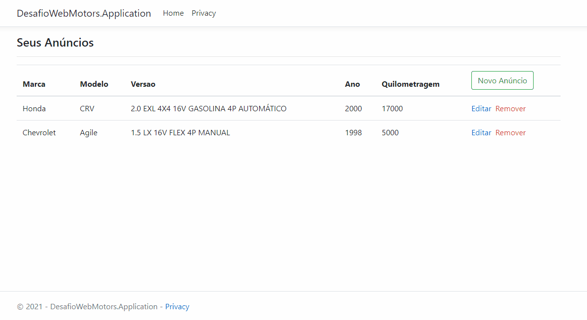
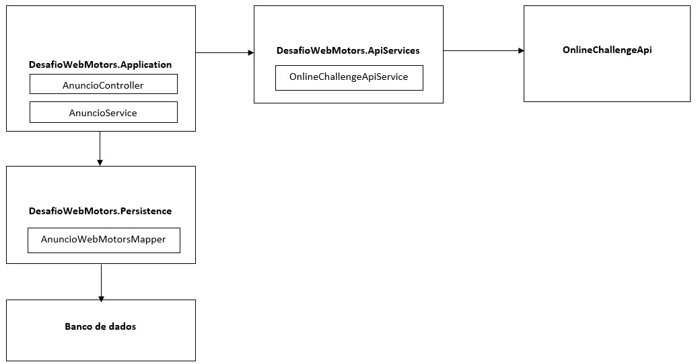

# Desafio Webmotors

Aplicação ASP.NET Core criada com o principal objetivo de prover uma funcionalidade básica de cadastro de anúncios com as operações básicas: inclusão, alteração, consulta e exclusão.

## Pré-requisitos

O que precisa ser instalado na máquina para estender e depurar o projeto:

    Visual Studio Community 2019 ou superior;
    Net Core SDK 3.1 ou superior;
    SQL Server

## Arquitetura

A solução utiliza uma arquitetura multi-camadas e está dividida em três projetos: DesafioWebMotors.Application, DesafioWebMotors.ApiServices e DesafioWebMotors.Persistence.

* **DesafioWebMotors.Application**: projeto desenvolvido usando ASP.NET Core MVC e tem a responsabilidade de ser a camada de front-end da solução. Possui referência para o projeto `ApiServices` para consumo da OnlineChallenge API e para o projeto `Persistence` para acesso aos dados. Principal classe: **AnuncioController.cs**.

* **DesafioWebMotors.ApiServices**: projeto do tipo .NET Core class library que utiliza a biblioteca `RestSharp` para consumo da OnlineChallenge API. Principal classe: **OnlineChallengeApiService.cs**.

* **DesafioWebMotors.Persistence**: projeto do tipo .NET Core class library que utiliza o `Entity Framework Core` para acesso a um banco de dados SQL Server. Principal classe: **AnuncioWebMotorsMapper.cs**.